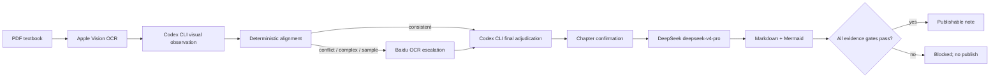

# PDF2MD

[](#license)
[](https://github.com/laoertongxue/PDF2MD/releases)
[](https://github.com/laoertongxue/PDF2MD/releases)

PDF2MD is a desktop workbench for intensive MBA and course reading. It organizes PDF
textbooks by course and chapter, produces Markdown reading notes, renders Mermaid diagrams,
and preserves material for later posts and long-form writing.

中文说明：[README.md](README.md)

## What It Is

PDF2MD is not a generic PDF-to-Markdown converter. Its primary workflow is to reread classic
MBA textbooks carefully, keep source evidence and page references, explain concepts in plain
language, study cases, solve practical problems, and turn the result into reusable writing material.

One course can contain multiple textbooks. Each textbook keeps its own source identity and
chapter structure, so similarly named chapters are not silently merged.

## Core Features

- Course workspaces for multiple textbooks, chapters, notes, and writing cards
- PDF textbook ingestion with chapter detection and explicit chapter confirmation
- Stable Markdown output with source evidence, page references, and fingerprints
- Direct Mermaid preview for knowledge maps and application flows
- Fixed structured intensive-reading sections: concept, plain-language explanation, case,
  practical problem solving, application boundaries, and action suggestions
- Tauri macOS desktop client with a bundled local parsing service

## Unattended Quality Pipeline

The application is designed to stop rather than publish uncertain material:



- Apple Vision performs the local primary OCR pass.
- Codex CLI independently inspects page images and performs the final adjudication.
- Only conflict, complex, and deterministic sample pages may use Baidu OCR.
- Every stage validates schemas, page/order/fingerprint evidence, and output structure.
- Failures, timeouts, cancellation, incomplete evidence, and invalid model output block
  publication. The UI must not present such a run as completed.

## Required Configuration

- Codex CLI must be a secure, directly executable file. A symlink or an executable that fails
  the security checks is rejected.
- DeepSeek uses the fixed model `deepseek-v4-pro`. Save and test the API key in the app's
  reading settings; the key is stored in macOS Keychain and is not written to course files,
  settings files, or logs.
- The Baidu OCR key is optional. It is required only when a conflict, complex, or sample page
  needs escalation. Without it, that page is blocked instead of silently downgraded.

## Current Real-Textbook Validation Status

Apple Vision PDF rendering and OCR caching have been exercised with the real scanned textbooks
`管理运筹学 (韩伯棠)` and `数据、模型与决策：基于电子表格的建模和案例研究方法（原书第 5 版）`.
The current machine's `/opt/homebrew/bin/codex` is a symlink, so the secure execution gate
correctly rejects it. Consequently, full unattended Codex review, Baidu escalation, chapter
confirmation, DeepSeek generation, and Markdown publication have not yet completed for those
books. The application correctly reports `blocked` and produces no publishable note.

## Download the Desktop App

The first release targets macOS Apple Silicon. Download the latest assets from
[GitHub Releases](https://github.com/laoertongxue/PDF2MD/releases):

- `PDF2MD_<version>_aarch64.dmg` for Finder installation
- `PDF2MD_<version>_aarch64.app.zip` as an equivalent app bundle archive
- The matching `.sha256` files for verification

The public build is ad-hoc signed; Developer ID signing and Apple notarization are not yet
configured. If Gatekeeper blocks the first launch, Control-click the app in Finder and choose
**Open**, then confirm the matching System Settings prompt. Only do this for a release asset
whose checksum matches the repository Release.

The Release workflow builds natively on an arm64 `macos-14` runner, embeds the Python runtime
and OCR schemas, verifies the app bundle and arm64 binaries, scans for development-machine paths,
cold-starts the sidecar in a restricted environment, checks `/health`, verifies the signature,
and publishes the DMG, ZIP, checksums, and provenance attestation.

## Development

```bash
git clone https://github.com/laoertongxue/PDF2MD.git
cd PDF2MD
python -m venv .venv
source .venv/bin/activate
pip install -e ".[dev,serve,llm]"

cd parsing-core-app
npm install
npm run tauri dev
```

Build the desktop bundle locally:

```bash
cd parsing-core-app
npm install
npm run tauri build
```

See [CHANGELOG.md](CHANGELOG.md) for release notes and [docs/acceptance/task-12/README.md](docs/acceptance/task-12/README.md)
for the multi-textbook interaction acceptance evidence.

## License

MIT
