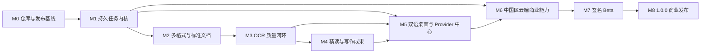

# PDF2MD 商业化实施总控计划

> **面向 AI 代理的工作者：** 必需子技能：使用 superpowers:subagent-driven-development（推荐）或 superpowers:executing-plans 逐任务实现此计划。步骤使用复选框（`- [ ]`）语法来跟踪进度。

**目标：** 将当前 PDF2MD 原型演进为面向中国大陆首发、支持中英文界面、可无人值守完成多教材精读与写作产出的正式 macOS 商业应用。

**架构：** 采用本地优先的混合架构：桌面端保存教材、标准文档、证据和成果，中国区托管服务提供账号、额度、模型网关和临时云端处理。以 SQLite 持久任务内核和 `CanonicalDocument` 为单一事实源，通过兼容门面逐步替换旧流水线，不做一次性重写。

**技术栈：** CPython 3.12、FastAPI、SQLite/WAL、Pydantic、React 19、TypeScript strict、Tauri 2、Rust、Apple Vision、Codex CLI、DeepSeek `deepseek-v4-pro`、百度 PP-StructureV3、PostgreSQL、Aliyun OSS/KMS、GitHub Actions。

---

## 1. 依据与当前结构快照

唯一产品规格：`docs/superpowers/specs/2026-08-12-commercial-mba-reading-workbench-design.md`。

CodeGraph 已于 2026-08-12 初始化并确认健康：216 个文件、4,148 个节点、11,515 条边。结构核查确认以下迁移锚点：

| 当前锚点 | 文件 | 商业版迁移方向 |
|---|---|---|
| `OcrWorkflow` | `src/parsing_core/workbench/ocr/workflow.py` | 由进程内线程迁入持久 `BookPipeline` |
| `import_sources`、`start_source_ocr` | `src/parsing_core/serving/api/routes_workbench.py` | 拆分路由，只提交应用命令 |
| `Repository`、`apply_workbench_schema` | `src/parsing_core/workbench/repository.py`、`schema.py` | 迁移为版本化 Migration 和端口实现 |
| `CodexVisionExecutor` | `src/parsing_core/workbench/ocr/codex_vision.py` | 成为可选本地视觉 Provider |
| `DeepSeekIntensiveReadingGenerator` | `src/parsing_core/workbench/ocr/deepseek_intensive_reading.py` | 纳入结构化精读与双重审查流水线 |
| `Settings` | `parsing-core-app/src/components/workbench/Settings.tsx` | 扩展为托管、CLI、BYOK Provider 中心 |
| `start_sidecar_with_intent` | `parsing-core-app/src-tauri/src/sidecar.rs` | 仅保留可信 Sidecar 生命周期与会话凭据 |

## 2. 不可变产品决策

- 一个课程可包含多本教材，每本教材保留独立章节树；跨教材关系由 `TopicMap` 表达。
- PDF、DOCX、PPTX、XLSX 和图片进入同一 `BookPipeline`，但分别由真实格式适配器解析。
- `CanonicalDocument` 是正文、结构、表格、公式、图像、来源坐标和 Markdown 的单一事实源。
- OCR 不能猜测。Apple Vision 与视觉模型无法确认时升级百度 OCR，再由独立裁决步骤决定；仍不确定的页面进入隔离并阻断相关章节。
- 精读输出必须包含可直接预览的 Mermaid 图，并通过真实渲染门禁。
- 托管服务是默认路径；Codex CLI、DeepSeek API、百度 API、OpenAI 兼容 API 和本地兼容端点均可配置。
- UI 首发必须同时支持 `zh-CN` 与 `en-US`，界面语言和成果输出语言彼此独立。
- 教材原文默认仅在本地，上传必须最小化、显式授权、加密、限时删除并生成回执。
- 质量优先于速度和费用；额度不足进入暂停状态，不能静默降级质量。

## 3. 里程碑依赖



M2 与 M5 的 API 契约任务可在 M1 合并后并行；M3 必须等待 M2 的标准文档与页级证据稳定；M4 必须等待 M3 的质量结果稳定；M7 必须等待 M0-M6 全部门禁通过。

## 4. 计划文件与退出门禁

| 里程碑 | 计划文件 | 必须交付 | 退出门禁 |
|---|---|---|---|
| M0 | `2026-08-12-commercial-mba-workbench-m0-repository-baseline.md` | 唯一 `main`、固定工具链、全仓质量门禁、Sidecar/API 安全基线 | 干净克隆可重复构建，快速测试全绿 |
| M1 | `2026-08-12-commercial-mba-workbench-m1-durable-pipeline.md` | 领域状态、Migration、持久 Job、租约、恢复、兼容门面 | 崩溃重启不丢任务、不重复执行 |
| M2 | `2026-08-12-commercial-mba-workbench-m2-canonical-import.md` | 五类格式适配器、Canonical AST、来源映射、确定性 Markdown | 每种真实 fixture 全链路通过 |
| M3 | `2026-08-12-commercial-mba-workbench-m3-ocr-quality.md` | 多引擎候选、升级、裁决、隔离、质量与费用治理 | 两本真实教材无需逐页干预且指标达标 |
| M4 | `2026-08-12-commercial-mba-workbench-m4-reading-writing.md` | 两遍章节、精读双审、Mermaid、卡片、TopicMap、写作草稿 | 两本教材产出可追溯成果 |
| M5 | `2026-08-12-commercial-mba-workbench-m5-desktop-providers.md` | 三栏桌面、双语、Provider 中心、Keychain、任务与证据 UI | 中英文真实 App E2E 与性能门禁通过 |
| M6 | `2026-08-12-commercial-mba-workbench-m6-cn-commercial-cloud.md` | 账号、设备、权益、额度、网关、删除、审计、支付与运营 | 安全、删除、计费、法务验收通过 |
| M7 | `2026-08-12-commercial-mba-workbench-m7-signed-beta.md` | 双架构签名、公证、Updater、私有回归、30 天 Beta | Beta 商业准入指标全部达成 |
| M8 | `2026-08-12-commercial-mba-workbench-m8-commercial-launch.md` | 中国区下载、GitHub 镜像、支持与发布运营 | 1.0.0 分阶段放量完成且可回退 |

## 5. 全局执行协议

每个任务严格执行以下顺序：

1. 读取该任务列出的文件和上一个任务的提交，不扩展到无关重构。
2. 先增加一个能描述期望行为的失败测试，并运行到可解释的失败。
3. 只实现使该测试通过的最小生产代码。
4. 运行任务级测试、相关模块回归和静态检查。
5. 运行规格审查：逐条核对该任务的验收规则。
6. 运行对抗式审查：重点寻找安全绕过、竞态、崩溃恢复、重复扣费、证据丢失、错误降级和无界资源。
7. 修复审查发现并重新执行测试。
8. 每个任务只产生一个主题明确的 Conventional Commit；不混入用户已有改动。

不得跨任务复用未提交的工作区状态。存在共享文件的任务按计划顺序串行执行；只读测试、独立适配器或独立云端模块才允许并行。

## 6. 全局质量命令

每个任务执行其局部命令；每个里程碑结束执行：

```bash
./scripts/verify-fast.sh
./scripts/verify-architecture.sh
./scripts/verify-security.sh
```

每个发布候选执行：

```bash
./scripts/verify-release.sh
```

四个脚本在 M0 创建，失败时必须原样返回非零状态。最低门禁为：

- Python：`ruff format --check`、`ruff check`、`mypy --strict` 新模块、`pytest` 与覆盖率。
- Frontend：Prettier、ESLint、`tsc --noEmit`、Vitest、生产构建、依赖审计。
- Rust：`cargo fmt --check`、`cargo clippy --all-targets -- -D warnings`、`cargo test`。
- 契约：OpenAPI 快照、TypeScript 生成客户端、i18n 键、数据库 Migration。
- 安全：Secret 扫描、依赖漏洞、许可证、恶意 Markdown/Mermaid/文件与未授权 API。
- 发布：真实 Sidecar、真实格式 fixture、签名、公证、Updater、SBOM 和校验和。

## 7. 真实教材与敏感数据规则

- 两本教材路径通过私有 Runner Secret 或受控挂载注入，绝不提交仓库。
- PR 使用合成 fixture；每日私有回归各抽 10 页；每周运行两本完整教材。
- 测试输出只保存页码、指标、哈希和脱敏失败类别，不上传正文、图像或本地完整路径。
- 真实供应商账号必须设置每日费用上限；重试复用 `provider_call_id`，失败调用不得计费。
- 任何真实教材失败都必须保留本地可复现工作包和证据哈希，不能只保留截图。

## 8. 规格追踪矩阵

| 规格章节 | 实现计划 |
|---|---|
| 产品范围、工作流、交互框架 | M4、M5 |
| 混合架构、中国区边界 | M5、M6 |
| 领域模型、工作区、状态机、缓存 | M1、M2 |
| OCR 质量、章节识别 | M3、M4 |
| 精读、写作、Mermaid | M4、M5 |
| Provider、Codex CLI、BYOK | M3、M5、M6 |
| 代码架构、清洁、性能 | M0、M1、M5、M7 |
| 双语、安全、隐私、合规 | M0、M5、M6、M8 |
| 测试、质量指标 | 所有里程碑；M3、M7 汇总真实教材证据 |
| CI、签名、更新、运营、商业 | M0、M6、M7、M8 |

## 9. 开始执行前检查

- [ ] 确认本地未跟踪的 `docs/CODE_SIGNING.md` 是用户已有文件，不读取、不修改、不暂存。
- [ ] 从 M0 任务 1 开始；在唯一 `main` 建立前不并行实施其他里程碑。
- [ ] 每个任务使用新子代理，任务后先规格审查，再进行对抗式代码审查。
- [ ] 仅在当前任务全部测试通过且审查问题清零后进入下一个任务。
- [ ] 每个里程碑保留测试收据、性能收据、真实教材收据和提交哈希。

## 10. 外部商业前置门禁

以下事项不能用代码替代，必须在进入 M7 前形成可验证收据：

- Apple Developer 付费账号、Developer ID Application 证书和公证权限已经开通。
- 中国大陆合法运营主体、域名、云账号、ICP备案或适用资质、支付商户和发票流程已经确认。
- DeepSeek、百度 OCR 和托管视觉供应商已签正式商业合同，明确 SLA、保密、保存、删除、分包和不得训练条款。
- 隐私、数据跨境、生成式 AI、AI 标识、知识产权、用户协议和投诉处置已经取得专项法律意见。
- 两本真实教材已取得私有自动化测试授权，并配置受控 macOS Runner。
- Tauri 更新私钥、云 KMS/Secret Manager、备份、值班和事故响应负责人已经就位。

缺少任一收据时，代码可以完成到 M6 验证环境，但不得进入签名 Beta 或公开商业发布。
