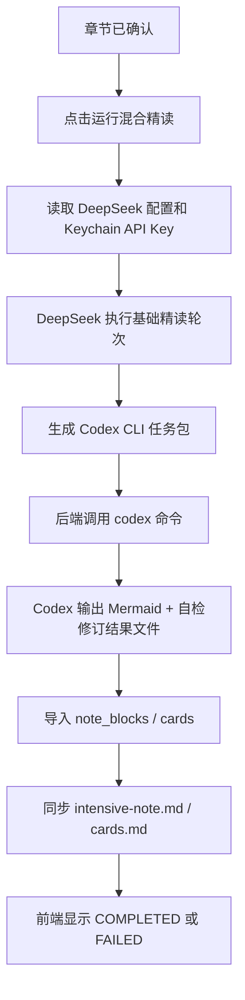

# 单章混合精读执行器设计规格

**日期**: 2026-07-09
**项目**: PDF2MD
**状态**: 已确认，待实现计划

## 1. 背景与目标

课程资料精读工作台已经具备课程、资料、章节、笔记块、Mermaid、卡片和 Markdown 同步的安全骨架。下一阶段聚焦真实精读质量，不扩批量任务、不做执行器平台，先打通单章高质量闭环。

目标是让用户在一个已确认章节上点击“运行混合精读”，由 DeepSeek 生成基础精读内容，由 Codex CLI 完成 Mermaid 图和最终自检修订，最终写回结构化笔记、卡片和 Markdown 产物。

## 2. 范围

### 2.1 目标

1. 支持单章手动运行混合精读。
2. DeepSeek 执行 `structure`、`concepts`、`plain_explain`、`application`、`cards` 五轮。
3. Codex CLI 执行 `mermaid`、`review` 两轮。
4. DeepSeek API Key 通过 macOS Keychain 保存和读取。
5. 设置页支持录入 DeepSeek API Key、配置 model、测试连接和脱敏展示。
6. Codex CLI 由后端自动调用，但只能读取任务包并写入指定结果文件。
7. 成功后章节状态为 `COMPLETED`，失败后章节状态为 `FAILED`，前端展示可理解错误。
8. 复用现有 `wb_runs`、`wb_note_blocks`、`wb_cards`、Markdown 同步和章节状态。

### 2.2 非目标

- 不做课程级批量运行。
- 不做成本统计。
- 不做执行器管理页面。
- 不做 Codex CLI 路径设置 UI。
- 不做失败轮续跑。
- 不允许 Codex CLI 直接写课程 Markdown 目录。
- 不把 DeepSeek API Key 存 SQLite、JSON 文件或日志。

## 3. 主流程

未确认章节不能运行混合精读。失败章节可以再次手动运行混合精读，第一版从头重跑，不做失败轮续跑。

## 4. 轮次分工

| round_key | 执行器 | 输出去向 |
|---|---|---|
| `structure` | DeepSeek | `wb_runs` + `summary` note block |
| `concepts` | DeepSeek | `wb_runs` + `concepts` note block |
| `plain_explain` | DeepSeek | `wb_runs` + `plain_explain` note block |
| `application` | DeepSeek | `wb_runs` + `application` note block |
| `cards` | DeepSeek | `wb_runs` + `wb_cards` |
| `mermaid` | Codex CLI | `wb_runs` + `knowledge_mermaid` / `application_mermaid` note blocks |
| `review` | Codex CLI | `wb_runs` + `reflection` note block |

Stub 执行器继续保留，用于测试和无真实配置时的开发验证，但用户触发“混合精读”时不得静默 fallback 到 Stub。

## 5. 后端设计

### 5.1 DeepSeekExecutor

`DeepSeekExecutor` 接收 round key 和章节任务包，调用 DeepSeek chat/completions。模型名称来自本地设置，API Key 从 macOS Keychain 读取。

失败条件：
- Keychain 中没有 API Key。
- DeepSeek model 未配置或为空。
- HTTP 请求失败、超时或返回非 2xx。
- 响应中没有可用正文。

失败时当前 run 标记为 `FAILED`，章节标记为 `FAILED`，API 返回明确错误。

### 5.2 CodexCliExecutor

`CodexCliExecutor` 只用于 `mermaid` 和 `review` 两轮。它将任务包写到服务数据目录下的 `workbench-runs`，同时指定输出文件路径，然后调用本机 `codex` 命令。

Codex CLI 路径解析顺序：

1. 环境变量 `CODEX_CLI_PATH`
2. 当前 PATH 中的 `codex`

找不到命令时返回 `codex cli not found`。

安全边界：
- Codex CLI 只能读取任务包文件。
- Codex CLI 只能写指定输出文件。
- 后端只从指定输出文件导入结果。
- 不允许 Codex CLI 直接修改课程目录中的 Markdown 文件。

失败条件：
- 命令不存在。
- 命令超时。
- 返回非 0。
- 输出文件不存在或为空。

### 5.3 HybridIntensiveReadingPipeline

第一版不重写现有 pipeline，只增加一个按 round 分发执行器的轻量入口：

- DeepSeek round 交给 `DeepSeekExecutor`
- Codex round 交给 `CodexCliExecutor`

仍复用现有：

- `build_task_package`
- `write_task_package`
- `_materialize_round`
- `sync_chapter_markdown`
- `wb_runs`
- `wb_note_blocks`
- `wb_cards`

成功完成全部轮次后，章节状态更新为 `COMPLETED`。任意一轮失败后，章节状态更新为 `FAILED`，已成功的前序 run 和 note block 保留，便于用户查看失败前产物。

## 6. 设置与 Keychain

### 6.1 设置页

新增 `/workbench/settings` 页面。

字段：
- DeepSeek API Key
- DeepSeek Model，默认 `deepseek-chat`

操作：
- 保存 API Key 到 macOS Keychain。
- 保存 model 到服务数据目录下的 `workbench-settings.json`。
- 测试连接：后端发一个最小 DeepSeek 请求验证 key 和 model。

展示：
- API Key 只脱敏显示，例如 `sk-****abcd`。
- 不向前端返回明文 key。

### 6.2 Keychain 存储

API Key 使用 macOS Keychain 保存。后端提供薄封装：

- save
- get
- mask
- delete

第一版只支持 macOS。非 macOS 环境返回明确错误，不降级到明文文件。

## 7. API

新增接口：

- `GET /api/workbench/settings`
  - 返回 model 和脱敏 key 状态。
- `POST /api/workbench/settings/deepseek`
  - 保存 API Key 和 model。
- `POST /api/workbench/settings/deepseek/test`
  - 测试 DeepSeek 配置。
- `POST /api/workbench/chapters/{chapter_id}/run-hybrid`
  - 对单章运行混合精读。

`run-hybrid` 规则：

- 章节不存在：`404`
- 章节状态不是 `CONFIRMED` 或 `FAILED`：`409`
- DeepSeek 配置缺失：`400`
- Codex CLI 不可用：`400`
- 运行失败：章节标 `FAILED`，返回可理解错误。
- 运行成功：章节标 `COMPLETED`，返回 `ChapterResponse`。

## 8. 前端设计

### 8.1 设置页入口

在工作台导航中新增“设置”入口。设置页负责 DeepSeek API Key、model 和测试连接。

### 8.2 单章运行入口

在章节确认页和章节精读页提供“运行混合精读”按钮。

按钮启用条件：

- `CONFIRMED`
- `FAILED`

按钮禁用条件：

- `DRAFT`
- `COMPLETED`
- 正在运行中

运行后刷新：

- chapter status
- note blocks
- cards

失败后展示后端 `detail`，并刷新章节状态为 `FAILED`。

## 9. 测试

### 9.1 后端测试

新增或更新：

- Keychain wrapper：mock 保存、读取、脱敏、删除。
- Settings API：保存 model、脱敏 key、缺 key 报错。
- DeepSeek executor：mock HTTP 成功、非 2xx、缺 key。
- Codex executor：mock 命令成功、超时、输出文件缺失。
- Hybrid pipeline：验证 round 分发、成功产出 blocks/cards、失败状态为 `FAILED`。
- API：`run-hybrid` 未确认返回 409，配置缺失返回 400，成功返回 `COMPLETED`。

### 9.2 前端验证

- TypeScript build 通过。
- 设置页不显示明文 key。
- 运行入口只在允许状态可用。
- 失败后展示后端错误并刷新章节状态。

## 10. 验收标准

1. 用户能在设置页保存 DeepSeek API Key 到 macOS Keychain。
2. 用户能配置 DeepSeek model 并测试连接。
3. 未配置 DeepSeek 时运行混合精读返回明确错误。
4. 找不到 Codex CLI 时运行混合精读返回明确错误。
5. 已确认章节能运行混合精读。
6. DeepSeek 执行基础精读轮次，Codex CLI 执行 Mermaid 和 review 轮次。
7. Codex CLI 只读任务包，只写指定结果文件。
8. 成功后章节状态为 `COMPLETED`。
9. 失败后章节状态为 `FAILED`，前端显示可理解错误。
10. 输出继续写入 SQLite 结构化数据，并同步为 Markdown。

## 11. 后续方向

本阶段稳定后，再考虑：

- 课程级批量运行。
- 失败轮续跑。
- Codex CLI 路径设置 UI。
- 成本统计。
- 每轮执行器可配置。
- 更完整的长文写作输出链路。
