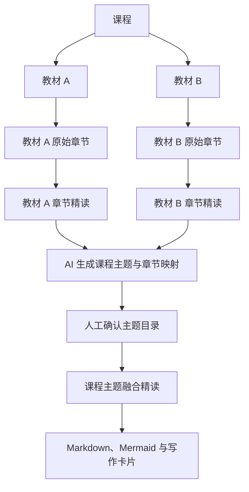

# 多教材课程主题融合精读设计规格

**日期**：2026-07-10
**项目**：PDF2MD 课程资料精读工作台
**状态**：已完成设计讨论，待用户审查书面规格

## 1. 背景与目标

一门 MBA 课程通常不只对应一本教材。用户可能为“人力资源管理”“战略管理”等课程准备两本或更多经典教材，希望既完整精读每本教材，又能跨教材建立自己的课程知识体系，最终服务贴文和公众号长文写作。

当前工作台已经具备“课程 -> 教材 -> 章节”的基本对象，但界面把同一课程下不同教材的章节混合展示，也缺少课程级主题、跨教材章节映射和融合精读能力。本设计在保留原书结构的基础上新增课程主题层，不用一本教材的目录替代另一本文献，也不把多本教材原文机械拼接后一次性总结。

目标是形成双层精读：

1. 第一层完整保留并精读每本教材的原始章节。
2. 第二层由 AI 综合已完成的章节精读结果，生成课程主题目录和章节映射。
3. 用户确认映射后，按课程主题生成带来源、可比较、可应用的融合精读笔记。

## 2. 已确认的产品决策

1. 一门课程支持两本及以上教材。
2. 每本教材保留独立目录、章节顺序和章节精读结果。
3. AI 根据所有教材的章节精读结果生成课程主题目录和初始章节映射。
4. 课程主题和教材章节采用多对多关系。
5. 用户可以调整主题名称、顺序、合并、拆分和章节映射。
6. 先分别完成教材章节精读，再生成课程主题融合精读。
7. 关键概念、观点、案例和分歧使用“教材名 + 章节”来源标记。
8. 主题关联的全部章节完成精读与自检后，才允许生成融合笔记。
9. 上游章节变化后，主题标记为“需要更新”，旧结果继续保留，由用户手动重新生成。
10. 课程主题使用增强型融合模板，必须呈现教材观点对照、共识与分歧、互补视角和综合框架。

## 3. 对象层级



### 3.1 课程

最高层组织单位，例如“人力资源管理”。课程拥有教材、课程主题、融合精读结果和课程级写作卡片。

### 3.2 教材

教材是课程下独立的主资料。第一阶段以 PDF 和 Word 为主。每本教材必须有独立书名、原始文件、章节目录、章节精读进度和输出目录。

### 3.3 教材章节

教材章节来自单本教材的章节识别结果。不同教材的同名章节不能混为同一对象。章节必须经过人工确认和独立精读，才能作为课程主题融合的可靠输入。

### 3.4 课程主题

课程主题是跨教材的知识组织单位，例如“招聘与甄选”“绩效管理”“薪酬激励”。主题不替代教材章节，而是建立在教材章节精读之上的课程级理解。

### 3.5 主题章节映射

课程主题和教材章节采用多对多映射：

- 一个课程主题可以关联多本教材的多个章节。
- 一个教材章节可以同时支撑多个课程主题。
- AI 生成初始映射，用户拥有最终确认权。
- 映射未确认前，不能运行主题融合精读。

## 4. 主流程

```text
创建课程
  -> 通过系统文件选择器导入两本或更多教材
  -> 分别识别每本教材的章节
  -> 按教材分组调整并确认章节
  -> 分别完成全部教材章节精读与自检
  -> AI 生成课程主题目录和多对多章节映射
  -> 用户改名、排序、合并、拆分及调整映射
  -> 用户确认课程主题目录
  -> 按主题运行融合精读
  -> 生成 Markdown、两张 Mermaid 图和写作卡片
```

AI 生成课程主题时，以已完成并经过自检的章节精读结果为主要输入，同时携带课程、教材和章节元数据。不得直接把多本教材完整原文作为一个超长上下文一次性总结。

## 5. 教材导入与章节处理

### 5.1 导入方式

- 点击“导入教材”打开系统文件选择器。
- 支持一次选择一本或多本 PDF、Word。
- 支持把教材文件拖入导入区域。
- 不要求用户手工粘贴文件路径。
- 每本教材按文件名预填书名，用户可以修改。
- 同一课程下允许继续追加教材。

### 5.2 章节展示

章节必须按教材分组展示：

```text
教材
├── 《教材 A》 18/18 章已精读
│   ├── 第 1 章
│   └── 第 2 章
└── 《教材 B》 12/15 章已精读
    ├── 第 1 章
    └── 第 2 章
```

点击教材后，只展示该书的章节候选、确认状态和精读进度。章节选择器和精读工作台必须显示教材名称，避免两本书同名章节产生歧义。

### 5.3 章节精读前置条件

- 章节未确认时不能运行章节精读。
- 每个章节独立执行既有多轮精读和自检。
- 章节精读结果继续包含固定栏目、两张 Mermaid 图和写作卡片。
- 单章失败不阻止其他章节继续精读。

## 6. AI 课程主题生成与人工确认

当课程下所有已确认教材章节完成精读与自检后，显示“AI 生成课程主题”操作。

AI 输出：

1. 课程主题名称与排序。
2. 每个主题的简短说明。
3. 主题与教材章节的初始多对多映射。
4. 建议合并或拆分的理由。
5. 未被任何主题覆盖的章节清单。

用户可以：

- 修改主题名称和说明。
- 拖动调整主题顺序。
- 新建或删除主题。
- 合并或拆分主题。
- 通过勾选增删关联章节。
- 查看每个章节已关联的主题数量。
- 确认整个课程主题目录。

主题目录确认后才能运行融合精读。主题目录后续仍可调整；调整映射会把已有融合结果标记为“需要更新”。

## 7. 课程主题融合精读

### 7.1 固定输出模板

每个课程主题生成一份结构稳定的 Markdown：

```markdown
# 主题名称

## 1. 主题概要
## 2. 关联教材与章节
## 3. 核心概念
## 4. 教材观点对照
## 5. 共识与分歧
## 6. 互补视角
## 7. 通俗、有趣、生活化的解释
## 8. 教材案例解读
## 9. 现实案例与问题解决
## 10. 综合分析框架
## 11. 实际应用方法
## 12. 延伸思考
## 13. Mermaid 知识结构图
## 14. Mermaid 应用流程图
## 15. 写作卡片
```

### 7.2 来源标记

- 核心概念、关键观点、教材案例和分歧必须标记来源。
- 来源格式为 `[《教材名》·第 N 章]`。
- 普通解释和过渡文字不要求逐段引用。
- 每份融合笔记开头列出全部关联教材章节。
- 来源标记必须能够在 App 中跳转到对应教材章节精读结果。

### 7.3 多轮生成


融合不能是章节精读结果的简单串联。必须解释教材之间的关系，并形成超越单本教材的课程级综合框架。

## 8. 状态与更新规则

课程主题使用以下状态：

- `未就绪`：存在尚未完成精读与自检的关联章节。
- `可生成`：映射已确认，全部关联章节已经完成。
- `生成中`：正在执行融合精读流水线。
- `已完成`：融合笔记、Mermaid 图和卡片生成成功。
- `需要更新`：关联章节或映射在上次成功生成后发生变化。
- `失败`：本次运行失败，但上一次成功结果仍然保留。

主题从 `未就绪` 进入 `可生成` 时不自动运行。用户手动启动融合精读。

上游章节重新精读、编辑章节笔记或修改映射后：

1. 主题标记为 `需要更新`。
2. 保留当前成功版本和全部运行记录。
3. 明确列出导致过期的章节或映射变化。
4. 用户手动选择重新生成。

## 9. 桌面端信息架构

课程工作台继续采用三栏结构：

```text
课程导航 | 教材或主题目录 | 当前操作与文档内容
```

课程内提供四个入口：

1. **教材**：导入教材、查看教材分组、章节和精读进度。
2. **课程主题**：生成、编辑和确认课程主题及章节映射。
3. **融合精读**：查看主题状态、运行融合精读和阅读结果。
4. **写作卡片**：汇总章节卡片与主题融合卡片，并按来源层级筛选。

主题映射编辑器左侧显示课程主题，右侧按教材分组显示章节，通过复选框维护多对多映射。每个主题必须显示关联章节数量、未完成依赖和当前状态。

## 10. 存储与文件组织

SQLite 继续作为工作态主存储，新增课程主题、主题章节映射、主题运行记录、主题笔记块和主题卡片等对象。Markdown 作为长期可读、可迁移的同步产物。

```text
课程目录/
├── 教材/
│   ├── 教材-A/
│   │   ├── 00-教材信息/
│   │   ├── 01-第一章/
│   │   │   ├── source.md
│   │   │   ├── intensive-note.md
│   │   │   ├── cards.md
│   │   │   └── runs/
│   │   └── ...
│   └── 教材-B/
│       └── ...
└── 课程主题/
    ├── 01-绩效管理/
    │   ├── topic-map.md
    │   ├── intensive-note.md
    │   ├── cards.md
    │   └── runs/
    └── ...
```

`topic-map.md` 保存主题说明、关联教材章节和映射确认信息。`intensive-note.md` 保存最终融合笔记。`cards.md` 保存主题写作卡片。`runs/` 保存每轮任务包和模型输出。

## 11. 错误处理

- 教材无法解析时，保留教材记录并显示具体文件和失败原因。
- 章节识别为空时，不创建空章节，允许重新识别或人工处理。
- AI 主题生成失败时，保留全部教材精读结果，允许单独重试。
- 主题映射未确认时，禁止运行融合精读。
- 关联章节未全部完成时，列出缺失章节并禁止运行。
- 单轮失败不覆盖上一次成功的主题结果。
- Mermaid 无法渲染时显示源码和错误信息，允许单独重跑 Mermaid 轮次。
- 删除教材或章节前，必须提示受影响的课程主题和融合结果。

## 12. 验收标准

1. 一门课程能够导入至少两本 PDF 或 Word 教材。
2. 导入使用系统文件选择器和拖拽，不要求手填路径。
3. 多本教材及其章节按教材分组展示，不混淆同名章节。
4. 每个教材章节能够独立确认和完成多轮精读。
5. 全部章节完成后，AI 能生成课程主题目录和多对多章节映射。
6. 用户能够改名、排序、新建、删除、合并和拆分主题，并调整章节映射。
7. 一个章节能够关联多个主题，一个主题能够关联多本教材的多个章节。
8. 主题映射未确认或存在未完成章节时，融合精读不能启动。
9. 融合笔记包含固定栏目、教材观点对照、共识与分歧、互补视角和综合框架。
10. 关键概念、观点、案例和分歧包含可跳转的教材章节来源标记。
11. 每份融合笔记包含两张可直接预览的 Mermaid 图和 8 至 12 张写作卡片。
12. 上游章节或映射变化后，主题标记为“需要更新”，旧结果和运行记录继续保留。
13. App 重启后，课程、教材、章节、主题、映射、笔记、卡片和运行记录能够恢复。
14. SQLite 工作态和本地 Markdown 文件保持同步。

## 13. 非目标

- 本阶段不自动发布公众号文章或贴文。
- 本阶段不自动把写作卡片编排成长文草稿。
- 本阶段不强制套用统一 MBA 教学大纲。
- 本阶段不为教材章节设置互斥的单主题归属。
- 本阶段不在上游变化后自动消耗模型重新生成主题结果。
- 本阶段不删除或折叠掉教材自身的原始章节结构。

## 14. 与现有系统的关系

现有课程、教材、章节、章节精读、运行记录、Markdown 同步、Mermaid 预览和卡片池继续复用。新增能力聚焦于：

- 多教材分组展示和系统文件导入。
- 课程主题对象。
- 主题与章节的多对多映射。
- AI 主题生成和人工确认。
- 主题融合精读流水线。
- 来源标记、依赖门槛和过期状态传播。

不重写现有解析内核和章节精读能力。
