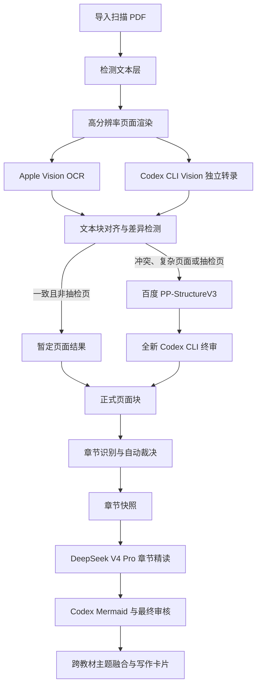

# PDF2MD 无人值守多引擎 OCR 与真实教材验收设计

## 1. 背景与目标

“数据、模型与决策”课程使用两本平行主教材：

- 《管理运筹学》（韩伯棠，第五版），549 页。
- 《数据、模型与决策：基于电子表格的建模和案例研究方法》（原书第 5 版），609 页。

两本 PDF 均为纯扫描图片，缺少可用文本层。本设计为 PDF2MD 增加无人值守 OCR 能力，并用真实教材验证从扫描 PDF 到章节精读、跨教材主题融合和写作卡片的完整桌面工作流。

核心质量原则：

1. 不把单一 OCR 或视觉模型的输出直接作为正式文本。
2. Apple Vision 与 Codex CLI Vision 先独立识别。
3. 无法确认的页面及 5% 已确认页面抽检调用百度千帆 PP-StructureV3。
4. 最终由全新 Codex CLI 会话依据原图和三方证据裁决。
5. 全流程无人值守，不要求人工逐页复核。
6. 每个正式结果必须保留原始观察、差异、裁决和页面坐标，禁止无证据猜测原文。

## 2. 范围

### 2.1 本阶段包含

- 扫描 PDF 文本层检测。
- PDF 页面高分辨率渲染和缓存。
- Apple Vision 本地 OCR。
- Codex CLI 图片识别与结构化输出。
- 双引擎文本块对齐和差异检测。
- 百度 PP-StructureV3 疑难页仲裁与抽样审计。
- Codex CLI 最终自动裁决。
- 标题、正文、页码、表格、公式、图片和脚注页面块。
- 页码及页面区域来源锚点。
- 无人值守断点恢复、缓存、限流和费用上限。
- 两本教材全量 OCR 和章节目录生成。
- 各选一个相关章节完成真实精读。
- 生成一个跨教材课程主题、两张 Mermaid 和写作卡片。

### 2.2 本阶段不包含

- 全部章节的 DeepSeek 精读生成。
- 云端上传整本 PDF。
- 依靠人工逐页校对建立金标准。
- 把模型语义合理化当作原文校正依据。
- PaddleOCR、Mistral OCR 或 Mathpix 的首版集成。

阶段 A 通过后，再决定是否扩展至两本教材全部章节。

## 3. 总体流程



## 4. 引擎职责

### 4.1 页面渲染器

- 以固定高分辨率渲染每个 PDF 页面。
- 保存 PDF 文件哈希、页面编号、图像哈希、尺寸和渲染参数。
- 对公式、表格、浅灰小字和多栏区域生成局部高清裁剪。
- 相同输入和参数命中缓存，不重复渲染。

### 4.2 Apple Vision 执行器

- 使用准确优先模式。
- 运行时确认 `zh-Hans` 和英文识别支持。
- 输出文字候选、置信度、边界框和阅读顺序观察。
- 不负责生成正式 Markdown，不执行语义纠错。

### 4.3 Codex CLI Vision 执行器

- 使用 `codex exec -i` 读取页面图像。
- 每个任务使用临时、无历史上下文会话。
- 使用 JSON Schema 约束输出标题、段落、页码、脚注、表格、公式、图片说明和不确定项。
- 输出必须包含页面坐标或对应区域引用。
- 不能根据上下文补写原图不可见内容。

### 4.4 差异检测器

- 按坐标、行和段落对齐 Apple 与 Codex 结果。
- 区分格式差异、标点差异、文字冲突、数字冲突、结构冲突和内容缺失。
- 对标题、页码、公式、表格和关键数字采用更严格规则。
- 产生机器可读差异报告和百度仲裁触发原因。

### 4.5 百度 PP-StructureV3 执行器

固定调用百度千帆 `pp-structurev3`，启用：

- 复杂版面区域检测。
- 表格识别。
- 公式识别。
- 表格单元格 OCR 重识别。
- 必要的页面和文本方向校正。

仅上传需要仲裁的单页 PNG 或局部裁剪，不上传整本 PDF、教材名称、本地路径或课程名称。

### 4.6 Codex 最终裁决器

每次裁决启动全新 Codex CLI 会话，输入：

- 原始高清页面或区域图像。
- Apple Vision 结果。
- 第一轮 Codex 结果。
- 百度 PP-StructureV3 结果。
- 自动差异报告。

固定输出：

```json
{
  "page": 123,
  "final_blocks": [],
  "resolved_conflicts": [],
  "tables": [],
  "formulas": [],
  "decision_evidence": [],
  "confidence": 0.0,
  "status": "accepted"
}
```

裁决不能仅按多数票选择。每项冲突必须引用原图区域和选择依据。

## 5. 百度仲裁触发规则

以下任一条件触发百度调用：

- Apple Vision 与 Codex 文字不一致。
- 任一引擎漏掉标题、脚注、页码或整行。
- 页面包含公式、表格、图表或复杂多栏排版。
- 数字、百分比、变量、约束符号或单位不一致。
- Codex 输出不确定项或表示图像不清晰。
- Apple Vision 置信度低于配置阈值。
- 已确认普通页面被 5% 随机质量抽检选中。

同一页面图像哈希、模型和策略配置命中缓存时，不重复调用百度。

## 6. 无人值守裁决规则

- 普通正文：至少两套独立结果逐行一致，并通过阅读顺序检查。
- 标题、章节号和 PDF 页码：必须完成三方或抽检一致性验证。
- 数字、百分比、变量、约束方向和单位：逐项比较，不允许语义猜测。
- 表格：核对行列数、合并单元格、表头和全部关键数字。
- 公式：核对变量、上下标、运算符、分式、矩阵和 LaTeX 结构。
- 未解决冲突自动重新裁剪、放大，并再次调用百度和新的 Codex 终审会话。
- 最终正式文本必须同时保存原始观察、差异和裁决记录。
- 自动裁决结果使用 `automated_adjudicated` 标记，与直接一致页面区分。

系统不得为了完成任务而丢弃冲突或静默选择看似合理的文本。

## 7. 数据模型

OCR 数据按层保存：

- `page_source`：PDF 文件、页面编号、页面图像、哈希和渲染参数。
- `ocr_observations`：Apple、Codex、百度的原始输出、坐标和调用元数据。
- `ocr_diffs`：文本块对齐、冲突类型和仲裁原因。
- `ocr_decisions`：最终 Codex 裁决、证据、状态和置信度。
- `page_blocks`：正式标题、正文、页码、脚注、表格、公式和图片块。
- `chapter_snapshot`：确认后的章节名称、顺序、页面边界和输入指纹。

所有下游精读任务以 `chapter_snapshot` 的输入指纹为准。OCR、章节边界或附件变化时，相关精读和融合产物进入 `STALE`，旧结果保留但不得冒充最新版本。

## 8. 凭据、隐私与费用

### 8.1 百度配置

- 设置页保存百度千帆 API Key。
- 模型固定为 `pp-structurev3`。
- API Key 存入 macOS Keychain。
- 前端只显示脱敏值。
- 测试连接使用内置无敏感信息图片。

### 8.2 隐私

- 不记录 API Key、Authorization header 或完整 Base64 图片。
- 上传请求使用随机任务 ID，不包含教材和课程身份。
- 百度返回的临时图片 URL 不作为长期证据。
- 本地原页面是唯一原始依据。
- 保存请求 ID、页面哈希、结构化结果、耗时和费用统计。

### 8.3 费用与限流

- 显示预计仲裁页数。
- 支持单次和单本教材调用上限。
- 对 429、服务错误和网络中断使用有限退避重试。
- 余额不足或达到上限时进入 `WAITING_FOR_RESOURCE`，恢复后从断点继续。
- 不允许无限重试或回退到单模型强行发布。

## 9. 错误处理与恢复

- 页面任务拥有持久化状态、owner、heartbeat 和输入指纹。
- 相同页面并发任务只能有一个 owner。
- 应用或 sidecar 退出后，运行中任务标记为可恢复中断。
- Apple 或 Codex 失败不删除另一方成功观察。
- 百度失败保留待仲裁状态和此前结果。
- 终审失败保留三方证据，可从终审步骤重试。
- 正式 `page_blocks` 仅在一次事务性发布中替换。
- 文件和数据库发布失败必须回滚到旧版本。

## 10. 真实教材阶段 A 验收

### 10.1 OCR 基准

每本书抽取约 10 页，覆盖封面、目录、正文、标题、表格、公式、图文混排和低对比度页面。

记录：

- 单页处理耗时。
- Apple 与 Codex 直接一致率。
- 百度仲裁触发率。
- 二次裁剪率和重试率。
- 数字、表格和公式冲突数。
- 三方原始结果和最终裁决。

### 10.2 两本书全量 OCR

- 无人值守处理约 1158 页。
- 疑难页及 5% 抽样页调用百度。
- 生成两本教材的章节树。
- 自动校验目录页码、正文标题和页面连续性。
- 保存章节快照和全部自动裁决记录。

### 10.3 对应章节精读

优先选择“线性规划”主题：

- 《管理运筹学》的理论与算法章节。
- 《数据、模型与决策》的电子表格建模与案例章节。

使用 `deepseek-v4-pro` 完成正文、概念、通俗解释、案例、应用和卡片轮次；使用 Codex CLI 完成两张 Mermaid 和最终审核。

### 10.4 跨教材融合

生成“线性规划：从数学模型到电子表格管理决策”主题笔记，包含共同概念、理论算法、电子表格实现、管理案例、敏感性分析、适用边界、综合案例、两张 Mermaid、来源跳转和写作卡片。

### 10.5 桌面可靠性

验证：

- 应用关闭与重启。
- OCR 和精读断点恢复。
- DeepSeek、百度限流和余额不足。
- Codex CLI 中断。
- 重复提交保护。
- 来源跳回原 PDF 页面和区域。
- 卡片编辑、收藏及刷新持久化。
- 1024x768 和 1440x900 两种视口。

## 11. 验收证据

最终报告包含：

- 两本 PDF 的哈希、页数和扫描质量。
- OCR 基准与全量运行统计。
- Apple、Codex、百度和终审结果样本。
- 百度调用、缓存、重试和费用统计。
- 最终章节目录与自动边界裁决记录。
- 两份章节精读 Markdown。
- 跨教材融合 Markdown。
- Mermaid 直接预览证据。
- 来源页码和区域跳转验证。
- 写作卡片及持久化验证。
- 关闭重启和失败恢复结果。
- 所有 Critical、Important 问题及修复复审结果。

## 12. 完成条件

本阶段仅在以下条件全部满足时通过：

1. 两本扫描教材完成无人值守 OCR 和章节目录生成。
2. 正式页面结果均具备原图、观察、差异和裁决证据。
3. 百度只收到疑难页和抽样页，不收到整本 PDF 或教材身份。
4. 两个相关章节完成真实 DeepSeek 与 Codex 精读。
5. 跨教材主题融合不是两篇摘要的简单拼接。
6. 每份 Markdown 包含两张可直接预览 Mermaid。
7. 来源可跳回教材 PDF 页和页面区域。
8. 中断、重启和重复提交不会丢失或覆盖结果。
9. 全流程不要求人工逐页复核。
10. 最终对抗式审查无未解决 Critical 或 Important。

