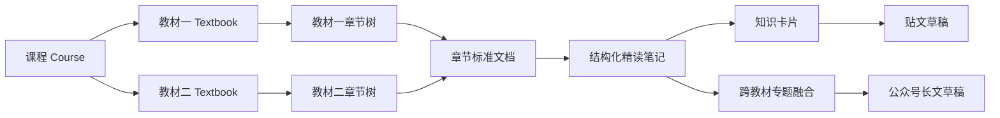
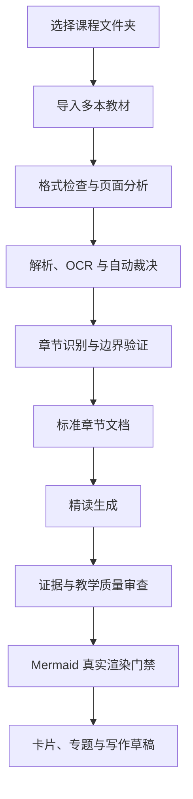
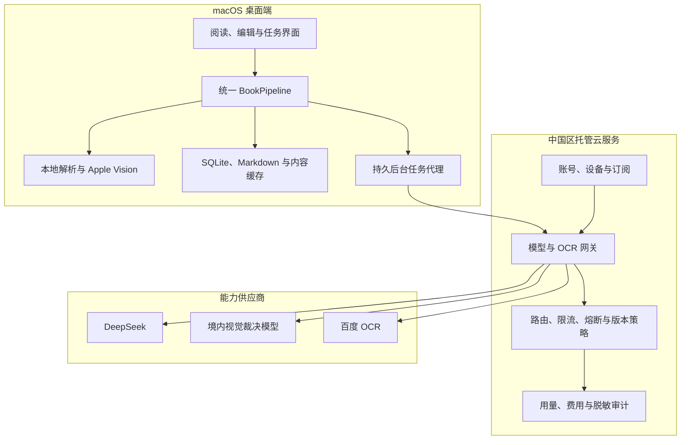
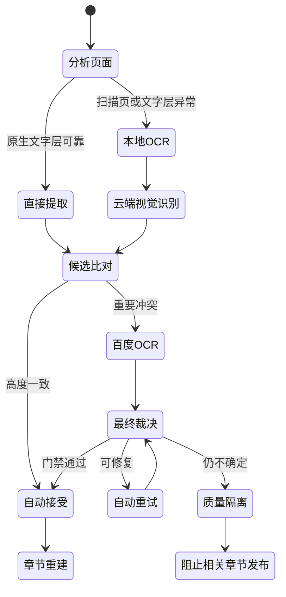

# PDF2MD 中国大陆双语商业版总体设计

## 1. 文档状态

- 日期：2026-08-12
- 状态：设计已逐节确认
- 首发市场：中国大陆
- 首发平台：macOS 13 及以上
- 首发语言：简体中文、英文
- 产品形态：本地优先、托管云能力、可选 BYOK 的混合桌面应用

本设计把 PDF2MD 从内部 Alpha 原型调整为可以收费交付的 MBA 教材精读与写作工作台。它是后续产品、架构、实现、测试和 Release 验收的共同依据。

本文不是法律意见。中国大陆商业上线前，仍需由具备资质的法律顾问确认隐私、生成式 AI、内容标识、知识产权、互联网信息服务和供应商合同要求。

## 2. 产品定义

PDF2MD 不再定位为“PDF 转 Markdown 工具”，而是：

> 本地优先的 MBA 教材精读与写作工作台：把多本教材转换为可追溯、可校验、可持续迭代的章节知识库，并进一步生成精读笔记、跨教材专题、知识卡片、贴文和公众号长文草稿。

核心价值不是格式转换，而是：

1. 多本教材进入同一门课程，但保留各自独立的目录、页码和版本。
2. 原生 PDF、扫描 PDF 和 Office/图片材料进入同一条可靠流水线。
3. 无人逐页干预地完成解析、OCR、章节识别、精读和验证。
4. 任何正式成果都能追溯到教材、页码、页面区域和处理版本。
5. Markdown 为可移植成果格式，Mermaid 必须能够直接预览。
6. 用户可以在类似语雀的阅读编辑界面中继续修改和组织写作。



## 3. 首版范围

### 3.1 必须具备

- 双击启动的正式 macOS App，不要求用户安装 Python、Homebrew 或开发工具。
- 用户选择任意本地文件夹作为课程工作区。
- 一门课程导入多本教材和补充材料。
- 支持 PDF、DOCX、PPTX、XLSX 和常见图片格式。
- 原生 PDF 与扫描 PDF 自动分流。
- Apple Vision、本地解析、托管视觉模型、百度 OCR 和自动裁决。
- 无人值守章节识别与断点恢复。
- 章节标准 Markdown、精读笔记、知识卡片和跨教材专题。
- 每篇精读笔记包含直接预览的 Mermaid。
- 简体中文和英文界面即时切换。
- 中文、英文和中英双语输出。
- PDF2MD 托管、Codex CLI、API/BYOK 三类 Provider 配置。
- Apple Silicon 与 Intel 安装包。
- Developer ID 签名、公证、自动更新、更新说明和 Release 下载。

### 3.2 首版不做

- 教材交易或版权内容市场。
- 公开分享社区。
- 不同用户之间共享教材全文。
- 默认云端永久保存整本教材。
- Windows、Linux、iOS 或 Android 客户端。
- 依靠人工逐页校对才能完成的工作流。

## 4. 用户工作流

1. 用户启动 App，选择托管模式、本地模式或 BYOK 模式。
2. 用户选择本地课程文件夹并新建课程。
3. 用户一次导入一本或多本教材。
4. 系统验证格式、哈希、页数、加密状态和重复文件。
5. 系统分析页面类型并执行原生提取或 OCR。
6. 多引擎比对、自动升级、裁决和质量门禁生成标准文档。
7. 系统生成每本教材自身的章节树并验证页面边界。
8. 系统按章节生成精读笔记并进行独立审查。
9. 通过验证的章节进入卡片、专题融合和写作工作区。
10. 用户查看来源、编辑内容、局部重跑和导出成果。



## 5. 交互框架

桌面端采用语雀式三栏工作台：

- 左栏：课程、全局搜索、资料导入、设置和账号。
- 中栏：当前课程的教材、章节、卡片和专题树。
- 主区：Markdown 阅读编辑器、任务进度和成果视图。
- 右侧辅助区：大纲、来源证据、质量状态、版本和任务日志。

界面要求：

- 导入、OCR、章节和精读不是割裂页面，而是同一资料的连续状态。
- 空闲、加载、失败、阻塞、离线、暂停和完成状态必须明确区分。
- 长章节、千级章节树和大量卡片使用虚拟化与增量加载。
- Mermaid 只渲染可见图表，并真实检查非空像素输出。
- 任意任务都能看到当前阶段、已完成页数、预计剩余时间、调用能力和失败原因。
- 用户可以关闭窗口让任务在菜单栏继续；明确退出时安全检查点并在下次启动恢复。

## 6. 混合架构



### 6.1 本地端职责

- 原始文件、课程目录、Markdown 成果和证据默认保存在用户工作区。
- 文件检查、PDF 渲染、原生文字提取和 Apple Vision。
- 任务状态机、断点续跑、本地索引、阅读、编辑和导出。
- Keychain、文件授权、单实例、Sidecar、菜单栏任务和自动更新。
- 云服务不可用时保护已有课程和成果，不破坏本地数据。

### 6.2 云端职责

- 账号、设备授权、订阅、额度和版本策略。
- 托管模型/OCR 密钥，屏蔽供应商接口差异。
- 请求鉴权、限流、重试、熔断、质量路由、用量和账单。
- 默认只接收任务所需的页面、裁剪区块或文本块。
- 云端续跑必须由用户独立授权，并按期限自动删除任务包。

### 6.3 中国区边界

- 中国区账号、网关、临时数据、审计和供应商调用默认位于境内。
- 中国区托管正式路径不依赖 Codex CLI。
- Codex CLI 可由用户主动配置为高级 BYOK 能力。
- 可能发生跨境处理的 BYOK Provider 必须单独告知并取得必要授权。
- 首版不提供公开发布平台，写作成果默认导出到本地。

## 7. 领域模型与工作区

### 7.1 核心领域对象

- `Course`：课程。
- `Textbook`：一本教材及其版本。
- `SourceRevision`：原文件哈希、类型、导入时间和解析版本。
- `Chapter`：一本教材自己的章节树和页码边界。
- `PageEvidence`：原图、原生文本、OCR 候选、坐标和质量信息。
- `CanonicalDocument`：裁决后的标准区块文档。
- `ReadingArtifact`：精读笔记、卡片、图表和练习。
- `TopicMap`：跨教材主题与章节映射。
- `PublicationDraft`：贴文或长文的版本化草稿。
- `Job`、`JobStep`、`JobEvent`：可恢复任务和完整事件记录。
- `ProviderCall`：模型/OCR 版本、耗时、用量、费用和错误，不含密钥。
- `QualityFinding`：阻断项、警告和修复记录。

### 7.2 存储原则

- SQLite 保存结构化状态、索引、关系和任务事件。
- Markdown、图片及证据文件保存在课程目录。
- 原始输入不可变，派生产物版本化。
- 所有路径尽可能相对课程根目录，课程移动后仍可打开。
- `CanonicalDocument AST` 是内容真源，Markdown 是确定性序列化结果。
- 每个 Markdown 区块具有稳定 ID，坐标来源保存在 `evidence.json`。
- 所有写入使用临时文件、`fsync` 和原子替换。

### 7.3 工作区结构

```text
课程目录/
├── course.yaml
├── sources/
│   ├── textbook-a.pdf
│   └── textbook-b.pdf
├── books/
│   ├── textbook-a/
│   │   ├── book.yaml
│   │   └── chapters/001-章节名/
│   │       ├── source.md
│   │       ├── intensive-reading.md
│   │       ├── evidence.json
│   │       └── assets/
│   └── textbook-b/
├── topics/
├── cards/
├── drafts/
└── .pdf2md/
    ├── workspace.sqlite3
    ├── blobs/
    ├── cache/
    └── logs/
```

## 8. 唯一流水线与状态机

系统只允许一条 `BookPipeline`：


约束：

- UI 按钮只能提交命令或读取状态，不能绕过流水线直接写文件。
- 状态转换只由后端领域服务执行，并记录不可变事件。
- 前端不能重新解释或改写后端状态。
- 每一步有输入指纹、输出制品、尝试次数、错误分类和检查点。
- App 崩溃、断网或退出后，过期租约自动恢复。
- 同一输入和配置命中幂等键时不得重复调用或扣费。

幂等键由以下内容组成：

```text
source_hash
+ page_or_chapter_id
+ pipeline_version
+ parser_or_model_version
+ prompt_version
+ normalized_parameters
```

## 9. 无人值守 OCR 质量闭环

### 9.1 质量定义

无人值守不是允许模型猜测，而是：

- 正常页面自动完成。
- 疑难页面自动升级到更多引擎。
- 引擎冲突由独立裁决器处理。
- 无法通过门禁的页面自动隔离。
- 其他章节继续处理。
- 被隔离页面所属章节不能冒充已验证成果。



### 9.2 页面流水线

- 文件导入后保存 SHA-256、页数、类型、加密状态和解析版本。
- 每页检查文字层、编码、字符密度、阅读顺序、图片占比和旋转。
- 页面分类为原生文本、扫描文本、混合页面、表格、公式、图示或空白。
- PDFium 负责稳定页面渲染。
- `pdfplumber/pdfminer` 负责原生文字块、字体、坐标和阅读顺序。
- Apple Vision 生成本地 OCR 候选。
- 托管视觉模型处理扫描页、复杂版式和语义完整性候选。
- 百度 PP-StructureV3 仅处理冲突页、复杂表格和版面疑难页。
- 独立裁决器读取页面图像、所有候选、坐标和冲突报告。
- 最终结果必须说明采用候选、修改项、依据和置信状态。

具体依赖在实施前必须完成许可证审计。存在 AGPL 或不适合闭源商业分发的库，不得未经商业许可直接打包。

### 9.3 分级升级

原生数字 PDF：

- 可靠文字层作为主候选。
- 目录、章节首页、数字、公式和表格执行视觉复核。
- 每章执行自动抽样；抽样失败时升级复核整章。

扫描 PDF：

- Apple Vision 与托管视觉模型独立识别。
- 普通正文只有在文字、行序、段落和覆盖率一致时自动接受。
- 标题、数字、金额、百分比、公式和表格执行严格比较。
- 区域遗漏、顺序冲突、异常字符或关键字段不一致时调用百度。
- 不能让第二个模型在看过第一个答案后只做语言润色。

### 9.4 初始门槛

- 页级覆盖率 `100%`，不允许丢页、重页或乱序。
- 普通正文候选归一化一致率至少 `99.5%`。
- 标题、页码、数字、公式和表格关键单元格要求精确一致。
- 所有正文区块具有页码和区域映射。
- 综合质量分至少 `98/100`，且关键错误数为 `0`。
- 总分不能抵消数字、公式、标题或缺页等关键错误。
- 阈值必须通过真实教材金标准校准，不能散落为魔法数字。

### 9.5 自动重试与隔离

重试按错误原因切换旋转、裁边、去噪、分辨率、栏模式、表格模式、区域裁剪或备用 Provider。最多执行三轮可解释重试。

三轮后仍无法确认的页面进入 `QUARANTINED`。系统继续处理其他内容，但相关章节保持 `BLOCKED_BY_SOURCE_QUALITY`，不得产生 `VERIFIED` 成果。

## 10. 章节识别

章节树采用全书两遍识别：

1. 综合 PDF 书签、目录页、标题字体、页码、编号模式和语义连续性生成全局候选。
2. 验证每个章节的起止页、层级、前后衔接和正文首段。

规则：

- 前言、目录、附录、索引和版权页为特殊节点。
- 全书页面全部归属且不重叠。
- 空洞、交叉边界和标题冲突触发自动重算。
- 每本教材保持自己的章节树。
- `TopicMap` 建立跨教材关联，但不改变原书目录事实。
- 章节识别完成后自动进入精读，不要求用户逐章确认。

## 11. 精读与写作质量

每章使用独立阶段：

1. 知识抽取：按来源区块提取概念、模型、公式、案例和观点。
2. 结构规划：按版本化模板生成精读大纲。
3. 内容生成：DeepSeek 完成通俗解释、生活化类比、案例和应用。
4. 证据核对：独立模型逐条核对来源事实、数字、公式和归因。
5. 教学审查：检查可理解性、案例有效性、遗漏、边界和反例。
6. Mermaid 生成：生成结构图、流程图或决策图。
7. 渲染门禁：真实解析和渲染 Mermaid，检查空图、语法和遮挡。
8. 最终发布：所有门禁通过后由 `DRAFT` 变为 `VERIFIED`。

每篇精读笔记必须包含：

- 本章学习目标。
- 核心概念的通俗、有趣、生活化解释。
- 原书模型、关键公式和适用条件。
- 教材案例拆解。
- 新的现实案例和逐步求解。
- 管理实践应用。
- 常见误区、失效边界和反例。
- 行动清单与思考题。
- 跨教材关联。
- 至少一张可直接预览的 Mermaid。
- 精确到教材、章节和页码的来源引用。

原书事实、模型解释、原创案例和推断必须明确区分。公开写作默认转述，不批量复制教材原文。

## 12. Provider 配置中心

### 12.1 Provider 类型

- PDF2MD 托管。
- Codex CLI。
- DeepSeek API。
- 百度 OCR API。
- OpenAI 兼容远程 API。
- 本地 OpenAI 兼容 API。

可独立路由：

- 文本精读生成。
- 视觉页面转录。
- 多候选最终裁决。
- 表格与版面 OCR。
- 事实和教学质量审查。
- 向量化与检索。

每个能力允许一个主 Provider 和一个备用 Provider。达到额度时暂停，不允许静默降级到不满足质量标准的能力。

### 12.2 Codex CLI

- 自动检测常见路径并支持系统文件选择器。
- 展示版本、登录状态、能力、模型和最后验证时间。
- 支持 CLI 自身的设备授权，不收集 ChatGPT 密码。
- 解析符号链接后验证真实目标、所有者、写权限和文件指纹。
- 支持 `--image`、`--output-schema`、`--ephemeral` 和严格配置能力探测。
- 每次运行使用隔离目录、最小环境、只读沙箱、超时和输出上限。
- 不继承用户项目规则，不允许访问课程工作区或执行写命令。

建议执行约束：

```text
codex exec
--ephemeral
--ignore-user-config
--ignore-rules
--strict-config
--sandbox read-only
--skip-git-repo-check
--output-schema <schema>
--image <explicit-page-image>
```

### 12.3 API/BYOK

- 密钥通过 Tauri 原生命令直接进入 macOS Keychain。
- 前端保存后只能获取掩码，不可读回完整密钥。
- 可配置 Base URL、模型、组织/项目 ID、超时、并发和能力。
- 连接测试只发送最小探测，不发送教材内容。
- 远程 API 默认要求 HTTPS。
- 本地地址必须使用独立的“本地 Provider”类型显式启用。
- 阻止云元数据地址、链路本地地址和不安全重定向。
- BYOK 请求由本地 Sidecar 直连，不经过 PDF2MD 云端。

## 13. 代码架构

采用渐进式替换，不进行一次性重写。先建立新内核和兼容门面，通过真实回归后删除旧路径。

```text
src/parsing_core/workbench/
├── domain/
│   ├── entities.py
│   ├── value_objects.py
│   ├── states.py
│   ├── quality.py
│   └── errors.py
├── application/
│   ├── commands/
│   ├── queries/
│   ├── pipelines/
│   └── services/
├── ports/
│   ├── documents.py
│   ├── ocr.py
│   ├── models.py
│   ├── repositories.py
│   └── artifacts.py
├── infrastructure/
│   ├── documents/
│   ├── providers/
│   ├── persistence/
│   ├── jobs/
│   └── filesystem/
└── presentation/
    └── dto.py
```

依赖规则：

- `domain` 不依赖 FastAPI、SQLite、文件系统、SDK 或环境变量。
- `application` 只依赖 `domain` 和 `ports`。
- `infrastructure` 实现 Provider、数据库和文件端口。
- API 只处理鉴权、DTO、命令调用和错误映射。
- React 只依赖公开契约，不了解文件布局或供应商响应。
- Tauri 只负责窗口、系统权限、Keychain、Sidecar 和更新。
- 只有真实存在多实现或测试替身的边界才定义 Protocol。

现有代码迁移：

- 拆分 `src/parsing_core/serving/api/routes_workbench.py`。
- 将 `ocr/workflow.py` 收缩为应用流水线步骤。
- 将 `ocr/orchestrator.py` 收缩为页面候选与裁决协调器。
- 将百度、DeepSeek、视觉模型和 Codex CLI 封装为统一 Provider。
- 前端删除状态二次归一化。
- `parsing-core-app/src/api/workbench.ts` 改为类型化契约客户端。
- 前端按课程、资料、章节、精读、专题、任务和设置分区。
- `src-tauri/src/sidecar.rs` 只负责可信 Sidecar 生命周期和日志。

## 14. 持久任务、并发与缓存

### 14.1 本地任务执行器

- SQLite 持久队列，不引入 Redis 或 Celery。
- API 提交后立即返回 `202 + job_id`。
- Worker 使用租约和心跳领取步骤。
- 过期租约自动恢复。
- 支持暂停、继续、取消和局部重跑。
- WebSocket 只通知，断线后按事件序号补拉。
- 工作区单写入锁，第二个 App 实例复用现有进程。
- SQLite 使用 WAL、`busy_timeout` 和短事务。

### 14.2 并发与背压

- PDF 渲染和图像处理进入受限进程池。
- Apple Vision 使用受限本地队列。
- 云端调用使用异步 I/O、供应商级并发和令牌桶。
- 章节允许少量并行，同一章节阶段严格有序。
- 下游变慢时暂停上游，不能无限生成大图。
- 页面流式处理，不把整本书位图放入内存。
- 并发结果最终按教材页码顺序提交。

### 14.3 缓存

- 页面渲染、OCR 候选和模型结果按内容哈希去重。
- OCR 无损图与 UI 缩略图分别保存。
- 缓存有总额度、LRU 和用户可见清理。
- 证据与已发布成果不能被当作临时缓存删除。
- 日志按日期和大小轮转，不保存正文、密钥和完整请求。

## 15. 代码清洁硬门禁

### 15.1 Python

- 商业首版固定 CPython `3.12.x`。
- `requires-python`、Ruff、mypy、Sidecar 和 CI 完全一致。
- `ruff format`、`ruff check` 零错误。
- 新领域和应用代码执行 `mypy --strict`。
- 不允许新增无说明的类型忽略。
- 领域与应用覆盖率至少 `95%`。
- 仓储和 Provider 覆盖率至少 `90%`。
- 全仓覆盖率不低于 `85%`。
- 状态机和质量评分执行属性测试和关键变异测试。

### 15.2 TypeScript 与 Rust

- TypeScript 开启 `strict`、`noUncheckedIndexedAccess` 和精确可选属性。
- ESLint、格式化、类型检查和 Vitest 零警告。
- Rust 通过 `cargo fmt` 和 `clippy -- -D warnings`。
- API Schema 变化必须通过契约检查。
- 禁止无界 `any`、静默 `catch`、未分类异常和散落环境变量读取。

### 15.3 全仓

- 业务路由不得直接读写磁盘或调用供应商 SDK。
- 新依赖记录用途、许可证、包体积、启动影响和替代方案。
- 锁文件是唯一发布依赖来源。
- Sidecar 发布阶段不解析宽泛依赖范围。
- 使用架构边界测试阻止反向依赖。
- 性能优化必须有基准或火焰图证据。
- PR 必须通过格式、静态检查、测试、契约和依赖审计。

## 16. 性能预算

基准机器：Apple M1、16 GB、macOS 13。

- App 冷启动 `p95 <= 3 秒`。
- 已建立索引的 1,200 页课程打开 `p95 <= 2 秒`。
- 常规点击反馈 `p95 <= 100 ms`。
- 主页面切换 `p95 <= 300 ms`。
- 300 页原生 PDF 在 `90 秒`内出现章节候选。
- 300 页原生 PDF 完整标准化不超过 `5 分钟`。
- 扫描 PDF 本地渲染加 Apple Vision 不低于 `20 页/分钟`。
- 本地空闲内存不高于 `500 MB`。
- 500 页处理峰值不高于 `2 GB`。
- 任务重启恢复不超过 `10 秒`。
- 重复运行至少复用 `80%` 已验证步骤。
- 10 万内容区块本地搜索 `p95 <= 200 ms`。
- 健康网络下 500 页扫描教材端到端目标 `<= 120 分钟`。
- 任何队列、日志、事件和缓存集合都有明确上限。

PR 运行小型性能测试，夜间运行完整性能测试。任一关键指标回退超过 `10%` 时自动阻止合并或创建阻断问题。

## 17. 双语设计

系统区分：

```text
ui_locale = zh-CN | en-US
source_language = auto | zh-CN | en-US | ...
output_locale = zh-CN | en-US | bilingual
artifact.locale = zh-CN | en-US
prompt_template.locale = zh-CN | en-US
```

要求：

- UI 切换即时生效，不重跑 OCR 或改变课程数据。
- 所有界面文案使用 ICU Message Format。
- 后端只返回错误码和结构化参数。
- 中英文资源键覆盖率 `100%`。
- CI 阻止新增硬编码 UI 文本。
- 中英文分别执行布局、截图、提示词和金标准测试。
- 法律文本由专业人员审阅。
- Info.plist、安装说明、Release Notes 和帮助中心均本地化。

## 18. 安全与隐私

### 18.1 桌面端

- Sidecar 只监听 `127.0.0.1` 随机端口。
- 每次启动生成 256 位随机会话令牌。
- 所有 HTTP、WebSocket 和管理接口验证令牌。
- 校验 Origin、限制 CORS、请求体和空闲时间。
- Tauri capability 最小化，不开放任意 shell 或文件系统。
- 路径执行规范化、符号链接和目录穿越检查。
- Markdown、Mermaid 和模型输出均视为不可信输入。
- 模型不能触发工具、文件、网络或 shell 操作。
- 文件解析进程限制页数、像素、压缩比、CPU、内存和磁盘。

### 18.2 云端

- Access Token 短期有效，Refresh Token 可撤销并存入 Keychain。
- 供应商密钥只进入服务端 KMS/Secret Manager。
- 临时对象采用 KMS 信封加密。
- 日志和遥测不保存教材正文、图像、密钥和完整本地路径。
- 默认任务完成即删除临时内容；异常重试最长建议保留 24 小时。
- 云端续跑任务包独立授权，最长建议保留 7 天。
- 删除覆盖对象、缓存、载荷和派生临时文件，并产生回执。

### 18.3 用户权利

- 隐私摘要和完整政策。
- 云端 OCR、模型、诊断和分析分别授权。
- 数据导出、账号删除、云任务删除和撤回授权。
- 默认关闭正文遥测。
- 供应商变更时重新告知影响。
- 供应商合同约束保密、保存、删除、分包和不得用于训练。

## 19. 中国大陆合规与知识产权

正式上线前完成专项法律评估，确认：

- 个人信息处理合法基础、最小必要、告知、同意、敏感信息和跨境要求。
- PDF2MD 在生成式 AI 服务中的责任角色。
- 模型/API 商业使用、备案和安全评估要求。
- 内容安全、投诉举报、未成年人和事件处置流程。
- AI 生成合成内容的显式与隐式标识实现。
- 网站、API、支付、发票和互联网服务所需资质或备案。

产品实现：

- 界面显示“AI 辅助生成、自动核验”状态。
- Markdown Front Matter 保存生成和模型追溯字段。
- HTML、PDF、DOCX 导出包含可见说明和可用元数据标识。
- 用户编辑后保留来源与版本记录。
- 不提供专门删除或伪造法定标识的功能。
- 用户导入前确认拥有合法使用权。
- 原书全文默认不上传、不跨用户共享、不用于训练。
- 长段原文复制和批量还原教材触发版权门禁。
- 建立权利投诉、证据保全和内容删除流程。

## 20. 测试策略

### 20.1 PR 快速测试

- 领域、状态机、幂等、质量评分和错误分类。
- 章节范围、页码覆盖和数字对齐属性测试。
- Migration、原子写入、崩溃恢复和缓存失效。
- Provider 成功、认证、限流、超时、断流和 Schema 契约。
- OpenAPI 与 TypeScript 客户端差异。
- 中英文资源、布局和可访问性。
- Markdown、Mermaid、XSS、恶意文件和提示注入。

### 20.2 集成与桌面 E2E

- 多教材导入和独立章节树。
- PDF、DOCX、PPTX、XLSX 和图片统一流水线。
- OCR 冲突升级、自动裁决和质量隔离。
- 退出、崩溃、断网、限流和磁盘不足恢复。
- 缓存命中与不重复扣费。
- Keychain 生命周期和数据库跨版本迁移。
- WebdriverIO Tauri 服务驱动真实 macOS App。
- 中文、英文和多窗口截图。
- Mermaid 实际像素非空检查。

### 20.3 真实教材

- 两本真实教材作为私有金标准，不提交公开 GitHub。
- 私有 macOS Runner 受控挂载，只上传指标和脱敏失败报告。
- 每日运行 10 页真实回归。
- 每周运行完整两本教材。
- 模型、提示词、OCR 或解析器升级必须运行全量对比。
- 真实供应商测试使用专用账号和费用上限。

## 21. 质量验收指标

- 页级完整率 `100%`。
- 已验证内容来源映射率 `100%`。
- 章节边界准确率至少 `99%`，关键章节不得遗漏。
- 普通中文正文字符错误率不高于 `0.2%`。
- 关键数字、公式符号和表格关键字段准确率至少 `99.9%`。
- Mermaid 解析和实际渲染成功率 `100%`。
- 来源性事实无证据率 `0`。
- 自动放行误接受率低于 `0.1%`。
- 中断和重启后可恢复且不重复计费。
- 两本教材无需逐页干预完成全流程。

## 22. CI、签名与 Release

### 22.1 CI

- Python：Ruff、mypy、pytest。
- Frontend：ESLint、TypeScript、Vitest、生产构建。
- Rust：fmt、Clippy `-D warnings`、tests。
- API Schema、i18n、许可证、Secret、SAST、漏洞和 SBOM。
- GitHub Actions 固定完整 commit SHA。
- `main` 始终可发布。

### 22.2 macOS 分发

- Developer ID Application 正式签名。
- Hardened Runtime、安全时间戳和最小 entitlement。
- 签名全部嵌套二进制、Python 运行时和动态库。
- Apple 公证并 staple 到交付物。
- `codesign`、`spctl` 和 `stapler` 在 CI 验证。
- Apple Silicon 与 Intel 分别构建。
- 中国大陆官网/CDN 为主下载，GitHub Release 为公开镜像。
- Release 包含中英文说明、SHA-256、SPDX SBOM 和来源证明。

### 22.3 自动更新

- Tauri v2 Updater。
- Apple 签名之外增加独立更新签名。
- `stable` 与 `beta` 渠道。
- 5%、25%、100% 分阶段放量。
- 数据库迁移前自动备份。
- 至少保持一个版本向后兼容。
- 严重问题可暂停清单和回退应用。
- 强制更新仅用于严重安全或服务失效场景。

## 23. 运营与商业能力

- 邮箱或手机号登录、设备会话和远程注销。
- 本地查看编辑不强制登录，托管调用要求账号。
- 套餐权益由服务端签名下发。
- `provider_call_id` 幂等记账。
- 整本书运行前显示页数、调用范围和费用区间。
- 额度不足进入 `PAUSED_BY_QUOTA`，不降低质量。
- 失败调用不扣费，退款、赠送、发票和对账可审计。
- 脱敏诊断包、状态页、安全邮箱和事件响应手册。
- Provider 质量下降自动熔断。
- 中国区 API 月可用性目标 `99.9%`。
- 网关额外延迟 `p95 <= 300 ms`。
- 严重数据丢失目标 `RPO <= 5 分钟`，恢复目标 `RTO <= 1 小时`。

## 24. 当前代码与目标差距

| 当前问题 | 目标调整 | 阻断门禁 |
|---|---|---|
| 嵌入 Python 缺少真实 PDF/PPTX/XLSX 解析依赖 | 从锁文件构建完整离线 Sidecar | 安装包真实格式冒烟通过 |
| OCR 完成状态可能被转换为阻塞 | 单一后端状态机 | 状态契约和恢复测试通过 |
| 旧章节与 OCR JSON 是两条流水线 | 统一 BookPipeline 与 SQLite 事实源 | 两条旧路径删除后全回归通过 |
| 每章需要手动确认和运行 | 全书自动章节与精读调度 | 两本教材无人值守完成 |
| 百度配置和调用边界不完整 | Provider 中心、Keychain、条件升级 | 连接、限流、删除和费用测试通过 |
| 页面串行且 Codex 调用无界 | 持久队列、受限并发、缓存和背压 | 性能与成本预算通过 |
| 正式版依赖用户安装 Codex CLI | 托管默认，Codex CLI/API 可选配置 | 无 CLI 干净 Mac 可完成托管流程 |
| 多格式入口超过真实解析能力 | 每种格式独立适配和真实 fixture | 宣称格式全部 E2E 通过 |
| 本地业务 API 缺少完整鉴权 | 随机端口、全接口令牌和 Origin 校验 | 未授权请求全部拒绝 |
| Ad-hoc、单架构、无更新 | Developer ID、公证、双架构、Updater | 干净 Mac 安装与 N-1 更新通过 |
| 缺少隐私、协议和许可证文件 | 双语法律文档、EULA、NOTICE、SECURITY | 法务和许可证审计通过 |
| Ruff、mypy、依赖漏洞和大 Chunk 未清零 | 稳定化里程碑先清零 | CI 全绿后才开发新流水线 |
| 日志、任务和缓存存在无界增长 | 轮转、租约、额度和 LRU | 24 小时稳定性测试通过 |
| 当前只有 `master` 且本地领先远程 | 审核本地改动后迁移为唯一 `main` | 本地与远程分支审计通过 |

## 25. 分阶段实施路线

### M0：仓库与发布基线

- 审核本地未推送提交和未跟踪文件。
- 将本地与远程治理为唯一 `main`。
- 固定 Python 3.12 与锁文件构建。
- 清零 Ruff、mypy、前端漏洞和关键跳过测试。
- 修复嵌入运行时和 OCR 状态死锁。
- 建立 PR CI、依赖审计和架构边界检查。

退出条件：当前功能在干净环境全绿，`main` 可重复构建。

### M1：领域、存储与持久任务内核

- 建立领域对象、状态机、错误分类和 Provider 端口。
- 建立事务 Migration、Job、JobStep、JobEvent 和 Artifact。
- 建立租约、心跳、取消、恢复、幂等和工作区锁。
- 让旧 API 通过兼容门面进入新内核。

退出条件：重启、崩溃和重复提交不会丢任务或重复执行。

### M2：多格式导入与标准文档

- PDF 原生提取和稳定渲染。
- DOCX、PPTX、XLSX 和图片适配。
- `CanonicalDocument AST`、来源映射和 Markdown 序列化。
- 内容哈希缓存、原子写入和工作区迁移。

退出条件：所有宣称格式真实 E2E 通过并生成可追溯 Markdown。

### M3：多引擎 OCR 与质量裁决

- Apple Vision、本地页面分析和候选比对。
- 托管视觉模型、百度 PP-StructureV3 和自动裁决。
- 自动重试、隔离、质量评分和金标准指标。
- 扫描教材性能、缓存、并发和费用治理。

退出条件：两本真实教材页级完整、指标达标且无需逐页干预。

### M4：章节、精读与跨教材成果

- 全书两遍章节识别。
- DeepSeek 精读、独立证据审查和教学质量审查。
- Mermaid 生成与真实渲染门禁。
- 卡片、TopicMap、贴文和长文草稿。

退出条件：两本教材完成章节精读、跨教材专题和写作成果。

### M5：语雀式双语桌面体验与 Provider 中心

- 三栏工作台、虚拟列表、长文编辑和证据面板。
- `zh-CN`、`en-US` 与输出语言分离。
- 托管、Codex CLI 和 API/BYOK 配置。
- Keychain、连接探测、能力路由、菜单栏和单实例。

退出条件：中英文桌面 E2E、布局和无障碍门禁通过。

### M6：中国区云端商业能力

- 账号、设备、订阅、额度、账单和删除。
- 中国区模型网关、限流、熔断、脱敏审计和 KMS。
- 隐私同意、AI 标识、投诉、安全和运营后台。
- 双语政策、协议、帮助和诊断。

退出条件：安全测试、数据删除、计费对账和法务验收通过。

### M7：签名 Beta

- Developer ID、Hardened Runtime、公证和双架构。
- Tauri Updater、分阶段发布和回退。
- 私有真实教材夜间回归和 30 天受控 Beta。
- 性能、崩溃、成本、质量和支持指标收敛。

退出条件：Beta 商业准入指标全部达到。

### M8：1.0.0 商业发布

- 中国大陆官网/CDN 和 GitHub Release。
- 中英文 Release Notes、SBOM、校验和来源证明。
- 状态页、支持、退款、发票和事故响应正式运行。
- 发布后观察、分阶段放量和应急回退。

## 26. 1.0.0 准入标准

- 严重和高危代码、安全、隐私问题为 `0`。
- 全仓静态、类型和测试通过，无关键跳过项。
- 两本真实教材无人值守全流程达到质量指标。
- 中文和英文界面、模板、法律文本和帮助完整。
- 托管、Codex CLI、DeepSeek API、百度 API 和兼容 API 可配置并通过连接测试。
- Apple Silicon 与 Intel 安装、签名、公证、更新和恢复通过。
- 30 天受控 Beta 完成。
- 崩溃自由会话至少 `99.5%`。
- 核心任务成功率至少 `98%`；其余任务进入明确可恢复或质量隔离状态。
- 法务确认中国区数据、生成式 AI、标识、知识产权和协议方案。
- 支持和事故响应至少完成一次演练。

## 27. 外部前置条件

- Apple Developer 付费账号和 Developer ID Application 证书。
- 中国区合法运营主体、域名、云账号、支付和发票能力。
- DeepSeek、百度和候选视觉模型的正式商业合同与 SLA。
- 隐私、生成式 AI、内容标识和知识产权专项法律意见。
- 两本真实教材的私有测试授权和安全 Runner。
- 更新签名密钥、云 KMS、Secret Manager 和事故响应负责人。

## 28. 官方参考

- [Apple：Notarizing macOS software before distribution](https://developer.apple.com/documentation/security/notarizing-macos-software-before-distribution)
- [Tauri：macOS Code Signing](https://v2.tauri.app/distribute/sign/macos/)
- [Tauri：Updater](https://v2.tauri.app/plugin/updater/)
- [Tauri：WebDriver testing](https://v2.tauri.app/develop/tests/webdriver/)
- [全国人大：中华人民共和国个人信息保护法](https://www.npc.gov.cn/npc/c2/c30834/202108/t20210820_313088.html)
- [国家网信办：生成式人工智能服务管理暂行办法](https://www.cac.gov.cn/2023-07/13/c_1690898327029107.htm)
- [国家网信办：人工智能生成合成内容标识办法说明](https://www.cac.gov.cn/2025-03/14/c_1743654685899683.htm)
